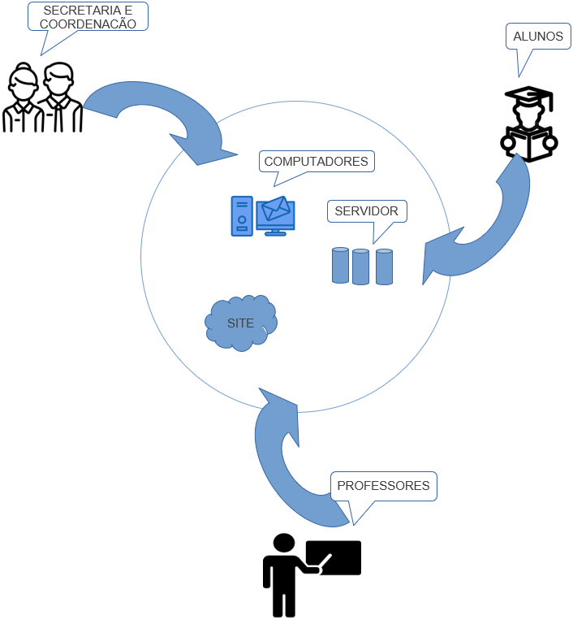

> AC 2 de Engenharia de Software

# Sumário
1. [Declaração do Problema](#declaração-do-problema)
2. [Análise Das Causas Raízes](#análise-das-causas-raízes)
3. [Usuários e Outros Stakeholders](#usuários-e-outros-stakeholders)
4. [Fronteira Sistêmica](#fronteira-sistêmica)

## Declaração do problema
O problema de falta de alunos, de sistemas e equipamentos antiquados afeta a qualidade de ensino dos alunos
e confiabilidade da empresa no mercado devido a baixo orçamento e poucas oportunidades para promover
atualizações dentro da empresa.

Os benefícios dessa atualização são:
- Aumento do número de alunos;
- Melhor experiência presencial e da plataforma online;
- Por meio de novas tecnologias, disponibilizar melhor suporte aos alunos.

## Análise Das Causas Raízes

## Usuários e Outros Stakeholders
| Usuários | Descrição |
| ------------- | ------------- |
| Alunos da Embromation | Os alunos são os principais usuários da plataforma online atualizada. Eles acessam o site para obter informações sobre os cursos oferecidos, matricular-se em cursos, pagar suas mensalidades e acessar materiais de aprendizado online. Os alunos também usam os computadores nas unidades físicas da Embromation para assistir aulas e realizar atividades escolares. |
| Professores da Embromation | Os professores usam os computadores da Embromation para preparar suas aulas, acessar o sistema de gerenciamento de aprendizado e interagir com os alunos por meio da plataforma online. Eles também são afetados pelas atualizações na infraestrutura de sala de aula. |
| Funcionários Administrativos da Embromation | Os funcionários administrativos usam os computadores para gerenciar as finanças da escola, manter registros de alunos e funcionários, gerenciar a infraestrutura física da escola e gerenciar o site. |

| Outros Stakeholders | Descrição |
| ------------- | ------------- |
| Despertar Tecnologia, Soluções em tecnologia empresarial SA | A empresa contratada para atualizar a infraestrutura de TI da Embromation é um stakeholder importante. Eles são responsáveis por desenvolver e implementar as novas tecnologias necessárias para melhorar a experiência dos usuários. |
| Clientes em potencial | As atualizações na plataforma online podem atrair novos clientes para a Embromation. Os clientes em potencial podem visitar o site para obter informações sobre cursos oferecidos e decidir se desejam se inscrever. |
| Fornecedores | Os fornecedores da Embromation, como fabricantes de hardware e software, são afetados pelas atualizações na infraestrutura de TI. Eles podem precisar fornecer suporte técnico ou serviços adicionais para garantir a compatibilidade dos seus produtos com a nova infraestrutura. |
| Concorrentes | Os concorrentes da Embromation são afetados pelas atualizações do projeto, pois podem precisar atualizar sua própria infraestrutura de TI para manter a competitividade no mercado. |

## Fronteira Sistêmica

## Integrantes Do Projeto (AC 2)
`Cliente:` Embromation LTDA

`Contratada:` Despertar Tecnologia - Soluções em tecnologia empresarial SA
#### Equipe Responsável
- Davi Martins Braga
  > **RA:** 2301642 | **E-mail:** davi.braga@aluno.faculdadeimpacta.com.br
- Marcio Rogerio Leme Zulin
  > **RA:** 2203393 | **E-mail:** marcio.zulin@aluno.faculdadeimpacta.com.br
- Felipe Vilaça Da Silva
  > **RA:** 2301771 | **E-mail:** felipe.vilaca@aluno.faculdadeimpacta.com.br
- Giovanni Aprile De Andrade
  > **RA:** 2202298 | **E-mail:** giovanni.andrade@aluno.faculdadeimpacta.com.br
- Lucas Alves Mota Folli
  > **RA:** 2203210 | **E-mail:** lucas.folli@aluno.faculdadeimpacta.com.br

